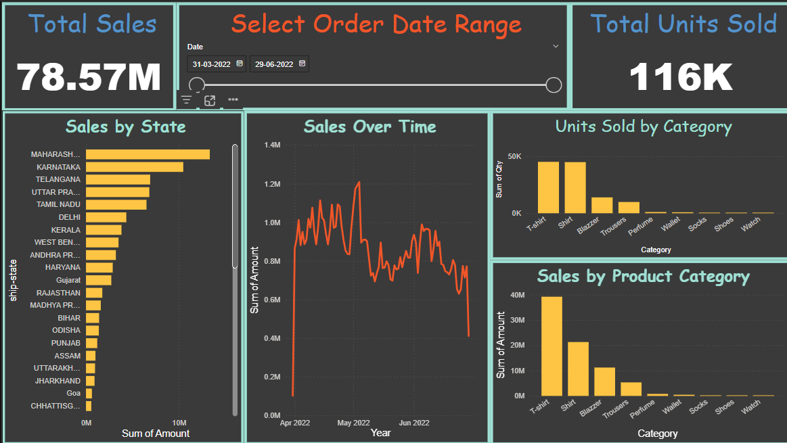
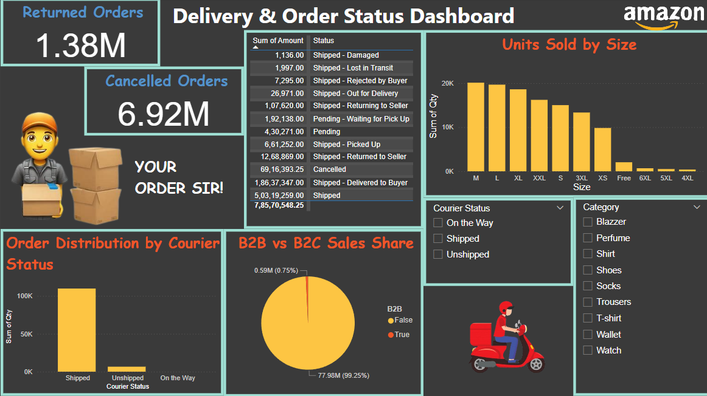

# 📊 Amazon Sales Data Analysis & Dashboard

This project focuses on analyzing and visualizing Amazon sales data using Python for data cleaning and Power BI for creating insightful dashboards.

---

## 🚀 Features

- Clean raw Amazon sales data using Python
- Handle missing values, date formats, and datatypes
- Create a professional dashboard in Power BI
- Analyze metrics like:
  - Total Sales & Units Sold
  - Sales by State
  - Category & Size-wise breakdown
  - Order status (Returned, Cancelled)
  - Courier distribution
  - B2B vs B2C sales

---

## 📁 Project Structure

```
amazon-sales-analysis/
├── data/
│   ├── Amazon Sale Report.csv
│   └── Amazon_Sale_Report_Cleaned.csv
├── dashboard/
│   └── [Power BI .pbix file]
├── images/
│   ├── amazon-dashboard-1.png
│   └── amazon-dashboard-2.png
├── amazon_data_cleaning.py
├── README.md
├── requirements.txt
└── .gitignore
```

---

## 🧹 Data Cleaning (Python)

Python script does the following:
- Drops unnecessary columns
- Fills missing values
- Converts date and postal code formats
- Saves cleaned data for dashboard use

Run it with:
```bash
python amazon_data_cleaning.py
```

---

## 📊 Dashboards (Power BI)

Two Power BI dashboards:
1. **Sales Overview**
2. **Delivery & Order Status**

📷 Previews:




---

## 🛠 Tech Stack

- Python (Pandas, Numpy, Matplotlib)
- Power BI
- Excel

---

## 📦 Requirements

Install Python libraries:
```bash
pip install -r requirements.txt
```

---

## 🤝 Contributing

Pull requests are welcome! For major changes, please open an issue first.

---

## 📄 License

This project is licensed under the MIT License.
